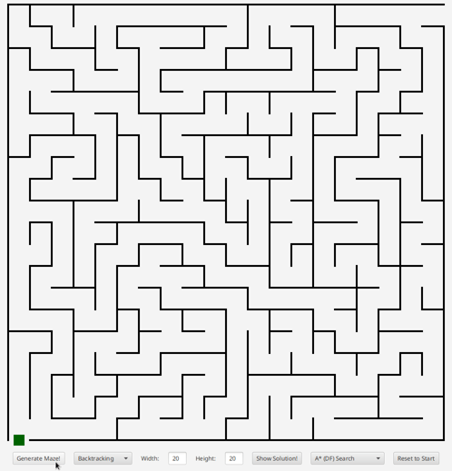

# Mazes
Generate AND solve mazes! The following solvers and generators are implemented.

## Solvers
- Depth first search
- Breath first search
- Iterative deepening
- Greedy search
- A* search

## Generators
- Recursive backtracking
- Recursive dividing rooms
- Randomized Kruskal's algorithm
- Randomized Prim's algorithm
- Wilson's algorithm
- Aldous Broder algorithm
- Hunt and Kill algorithm

## Execution instructions
First download the JavaFX SDK from [here](https://gluonhq.com/products/javafx/).
```
$ PATH_TO_FX=$(pwd)/javafx-sdk-11.0.2/lib/
$ cd src
$ javac --module-path $PATH_TO_FX --add-modules javafx.controls com/borroot/Main.java
$ java  --module-path $PATH_TO_FX --add-modules javafx.controls com.borroot.Main
```
